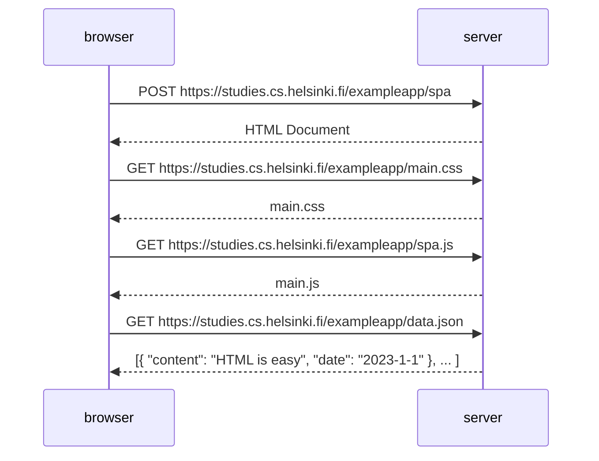

```mermaid
sequenceDiagram
    participant b as browser
    participant s as server
    b->>s:POST https://studies.cs.helsinki.fi/exampleapp/spa
    s-->>b: HTML Document
    b->>s:GET https://studies.cs.helsinki.fi/exampleapp/main.css
    s-->>b:main.css
    b->>s:GET https://studies.cs.helsinki.fi/exampleapp/spa.js
    s-->>b:main.js
    b->>s: GET https://studies.cs.helsinki.fi/exampleapp/data.json
    s-->>b: [{ "content": "HTML is easy", "date": "2023-1-1" }, ... ]  
```