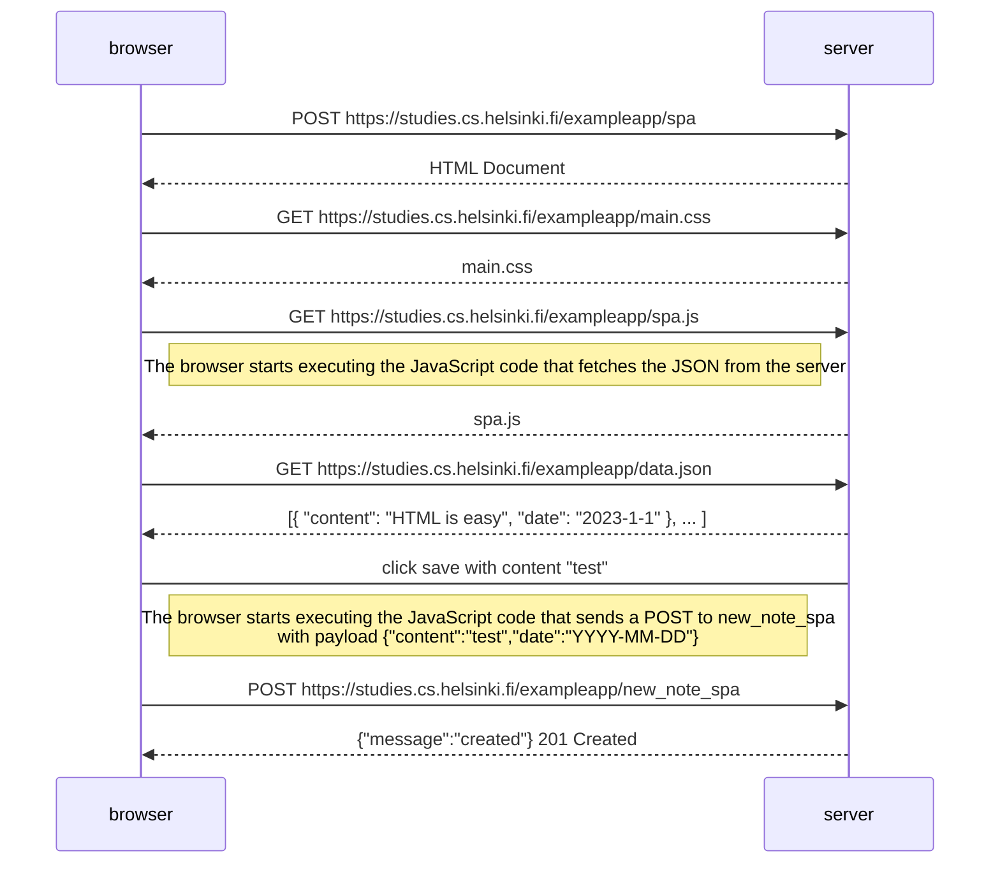

```mermaid
sequenceDiagram
    participant b as browser
    participant s as server
    b->>s:POST https://studies.cs.helsinki.fi/exampleapp/spa
    s-->>b: HTML Document
    b->>s:GET https://studies.cs.helsinki.fi/exampleapp/main.css
    s-->>b:main.css
    b->>s:GET https://studies.cs.helsinki.fi/exampleapp/spa.js
    Note right of b: The browser starts executing the JavaScript code that fetches the JSON from the server
    s-->>b:spa.js
    b->>s: GET https://studies.cs.helsinki.fi/exampleapp/data.json
    s-->>b: [{ "content": "HTML is easy", "date": "2023-1-1" }, ... ]
    b->s: click save with content "test"
    Note right of b: The browser starts executing the JavaScript code that sends a POST to new_note_spa<br> with payload {"content":"test","date":"YYYY-MM-DD"}
    b->>s: POST https://studies.cs.helsinki.fi/exampleapp/new_note_spa
    s-->>b: {"message":"created"} 201 Created
```